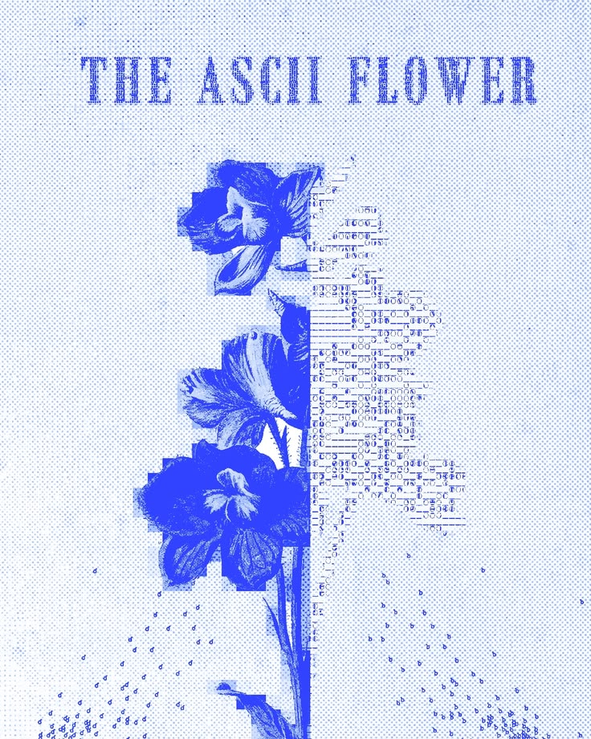
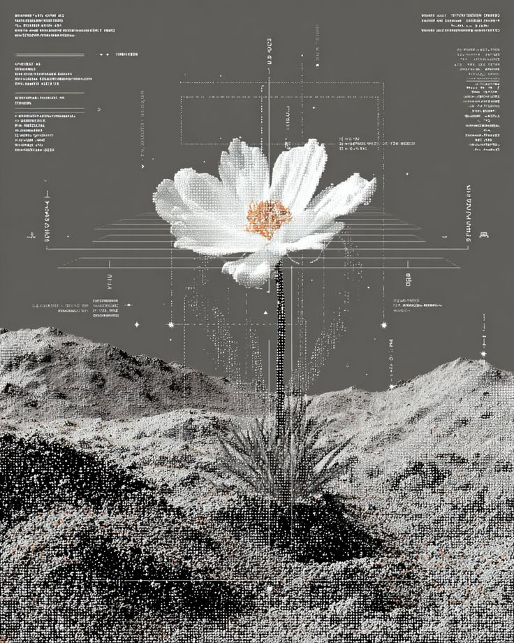

# Jinx

### 质量工程 · 自动化测试 · AI 辅助工程

**在故障里找秩序，在系统里给变化留余地。**

写下能运行的答案，也把问题留着。

---

<table>
  <tr>
    <td width="58%" valign="top">
      <h2>我在做的事</h2>
      
我的工作常常发生在结果出现之前。

      
我会先弄清变化影响了哪里，失败经过了哪条路径，问题能不能稳定复现。

      
测试是我理解系统的方式。一次异常往往会带出被省略的前提、没有说清楚的依赖，还有一些大家默认不会出错的地方。

      
我喜欢第二天还能看懂的东西：一个不用猜的名字，一段没人盯着也能正常工作的自动化，一份能让后来者少绕路的记录。

    </td>
    <td width="42%" align="center" valign="middle">
      
    </td>
  </tr>
</table>

## 42

  <h1>42</h1>
  
关于生命、宇宙以及一切。

我喜欢 `42`。它看起来像标准答案，其实更像一句提醒：问题没问对，答案再漂亮也没用。

动手之前，我通常会先问：什么真的会坏？谁会因此停下来？眼前的修复，能不能帮到下一次判断？

问题定方向，验证补边界，反馈决定下一步。

## 数字生命

我对数字生命的兴趣很具体：让工具记住上下文，知道当前目标，能够调用其他工具，做完以后再检查一次。

这些能力进入真实工程现场后，工具需要看懂环境的变化，知道什么时候停下，信息不足时明确说不知道，并把过程留给后来的人。

我不急着给它一个宏大的定义。能在变化里继续观察、修正和记忆，已经足够有趣。

## 此刻

- 把分散的 API 与 UI 测试，收拢成可观察、可维护的路径
- 让质量平台接住散落在需求、执行与反馈之间的上下文
- 让 Agent 走进真实的工程现场，而不只停留在演示里
- 把每次排障的过程整理好，下一次可以直接复用

## 一起工作时

我反对低效会议，也珍惜没有被切碎的专注时间。测试需要把一个系统放进许多种可能里反复观察，完整的时间往往比仓促的热闹更有价值。

有明确目的的沟通，我喜欢短、准、带上下文；没有目的的聊天可以很自由，常常一聊就停不下来。

如果一件事真的着急，请直接告诉我期待的时间。一个清楚的期限，比“不急，你看着来”更能让事情顺利发生。

我的测试与排障记录会写得很细。下一次有人走到这里时，可以直接沿着记录继续查，不用重新猜一遍。

## 离开编辑器之后

大多数时候我很热情，也很好奇。电量充足时什么都想聊，电量告警后会安静一阵，充好再回来。

我打了很多年游戏，会调酒，喜欢剧本杀和探店。也喜欢大型犬、晒太阳、草坪和河边，是“公园二十分钟定律”的忠实用户。

## 手上的工具

  
  
  
  
  
  
  
  

## 坐标

[jinxquq.github.io](https://jinxquq.github.io) · 经历、工程实践与个人表达

---

  
在确定的逻辑里，为未知保留一点余地。

