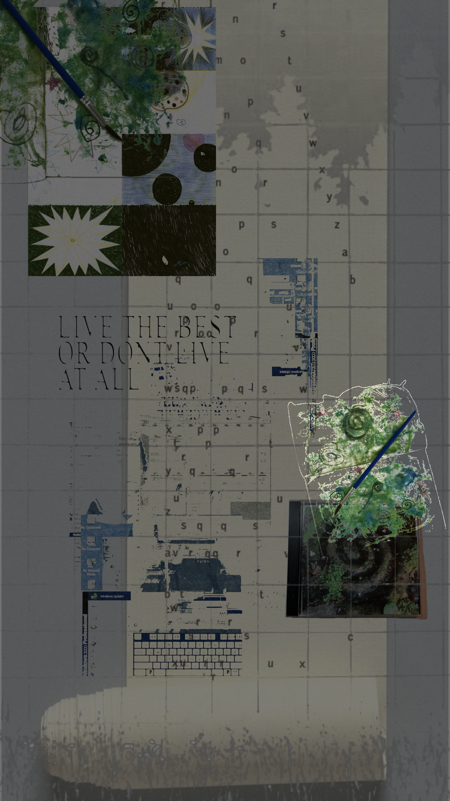

# Jinx

### 质量工程 · 自动化测试 · AI 辅助工程

**把代码当作手艺，把系统看作一种持续生长的生命。**

  
  
  

---

<table>
  <tr>
    <td width="58%" valign="top">
      <h2>关于我</h2>
      
我是一名质量工程师。

      
我关心的不只是让测试跑起来，而是如何让质量成为系统自身的一部分：问题能够被看见，经验能够被复用，反馈能够抵达真正需要它的人。

      
我喜欢那些看起来安静，却经得住时间的工程设计。清晰的命名、克制的边界、可靠的反馈，以及在故障发生之前就被认真对待的细节。

      
<strong>好的代码不只是正确，它还应该有结构、节奏和温度。</strong>

    </td>
    <td width="42%" align="center" valign="middle">
      
    </td>
  </tr>
</table>

## 我正在构建

- 将 API 与 UI 自动化沉淀为可复用、可维护的质量能力
- 通过质量平台连接需求、执行、反馈与工程决策
- 探索 Agent 与大模型在测试、交付和运维中的真实价值
- 把一次次排障与踩坑，转化为团队可以继承的知识资产

> 自动化不是为了替代思考，而是把人的注意力还给更重要的问题。

## 我理解的数字生命

当一个工具开始拥有上下文、记忆、感知、判断与行动能力，它就不再只是等待调用的静态脚本。

我感兴趣的是这种新的工程形态：让系统能够理解目标、观察环境、调用工具、校验结果，并在反馈中持续修正自己。它未必是传统意义上的“生命”，但已经拥有了生命系统最迷人的部分：**循环、适应与生长。**

| 感知 | 判断 | 行动 | 反馈 |
| --- | --- | --- | --- |
| 看见真实状态 | 理解目标与约束 | 调用工具完成任务 | 验证结果并继续修正 |

## 我的工程准则

| 准则 | 我在意的事情 |
| --- | --- |
| 让复杂有边界 | 模块职责清楚，变化不会无序扩散 |
| 让失败可观察 | 错误能够定位，过程能够解释，结果能够追溯 |
| 让经验可复用 | 一次解决的问题，不应该反复消耗不同的人 |
| 让系统比个人可靠 | 能力沉淀在流程、平台与自动化里，而不是只存在于记忆中 |

## 技术工具箱

  
  
  
  
  
  
  
  

## 公开作品

| 项目 | 内容 |
| --- | --- |
| [个人作品页](https://jinxquq.github.io) | 我的经历、工程实践与个人表达 |
| [API 自动化实验室](https://github.com/JinxQuQ/pytest-autu-api) | 基于 Pytest 的接口自动化探索 |
| [Django 实验室](https://github.com/JinxQuQ/Django) | 后端与 Web 应用实践 |
| [Next.js Dashboard](https://github.com/JinxQuQ/nextjs-dashboard) | 现代前端与数据看板实验 |

## GitHub 轨迹

  
  

---

  

  
<strong>愿代码不只正确，也拥有结构、节奏与生命。</strong>

  个人主页：<a href="https://jinxquq.github.io">jinxquq.github.io</a>

